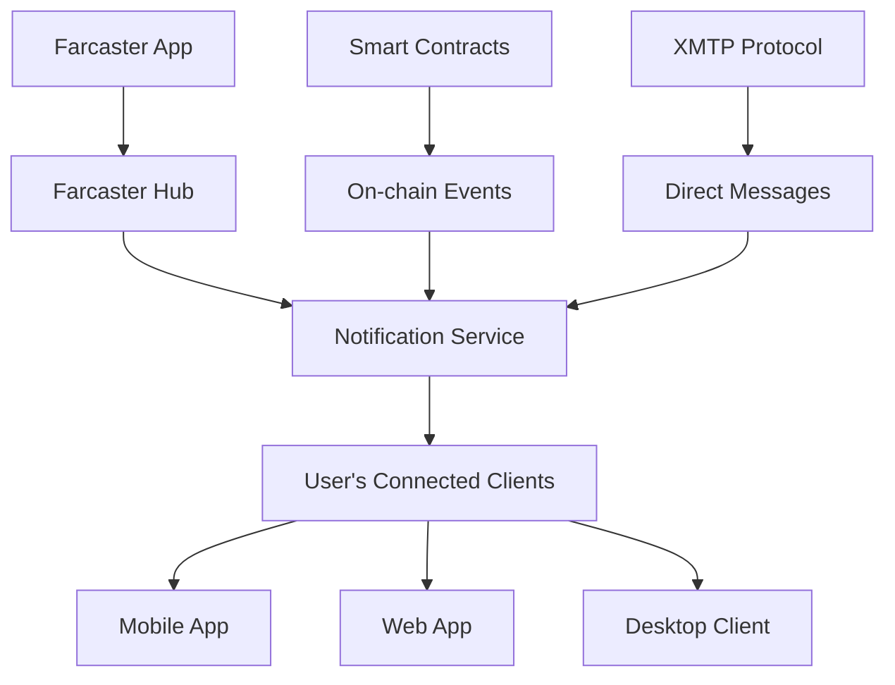

# Farcaster Notifications: Complete Guide

## Overview

Farcaster notifications are a decentralized notification system that enables applications to send real-time updates to users across the Farcaster protocol ecosystem. Unlike traditional centralized notification systems, Farcaster notifications leverage blockchain technology and decentralized infrastructure to provide censorship-resistant, user-controlled messaging.

## Table of Contents

1. [Architecture Overview](#architecture-overview)
2. [Notification Types](#notification-types)
3. [How Notifications Work](#how-notifications-work)
4. [Implementation Methods](#implementation-methods)
5. [API Integration](#api-integration)
6. [Best Practices](#best-practices)
7. [Examples](#examples)
8. [Troubleshooting](#troubleshooting)

## Architecture Overview

### Core Components



### Key Infrastructure

1. **Farcaster Hubs**: Decentralized nodes that store and relay Farcaster data
2. **Notification Aggregators**: Services that collect and format notifications
3. **Client Applications**: End-user applications that display notifications
4. **XMTP Integration**: For direct messaging notifications
5. **On-chain Events**: Smart contract interactions that trigger notifications

## Notification Types

### 1. Social Notifications

#### **Mentions**
- When a user is mentioned in a cast (post)
- Format: `@username mentioned you in a cast`
- Payload includes: cast content, author, timestamp

#### **Replies**
- When someone replies to your cast
- Format: `@username replied to your cast`
- Payload includes: reply content, parent cast, author

#### **Likes/Reactions**
- When someone likes or reacts to your content
- Format: `@username liked your cast`
- Payload includes: reaction type, cast content, author

#### **Follows**
- When someone follows your account
- Format: `@username started following you`
- Payload includes: follower profile, timestamp

#### **Recasts**
- When someone recasts (shares) your content
- Format: `@username recasted your cast`
- Payload includes: original cast, recaster profile

### 2. Channel Notifications

#### **Channel Invites**
- When you're invited to join a channel
- Format: `You've been invited to join /channel-name`
- Payload includes: channel info, inviter, permissions

#### **Channel Activity**
- New posts in channels you follow
- Format: `New activity in /channel-name`
- Payload includes: cast content, channel context

#### **Moderation Actions**
- When content is moderated in channels you manage
- Format: `Moderation action required in /channel-name`
- Payload includes: content details, action type

### 3. Application Notifications

#### **Frame Interactions**
- When users interact with your Frames
- Format: `User interacted with your Frame`
- Payload includes: interaction data, user info, frame context

#### **NFT/Token Activity**
- When tokens you hold have activity
- Format: `Activity detected for your NFT collection`
- Payload includes: contract address, token ID, action type

#### **Governance**
- DAO proposals and voting notifications
- Format: `New proposal in [DAO Name]`
- Payload includes: proposal details, voting deadline

### 4. Direct Messages (via XMTP)

#### **New Messages**
- When you receive a direct message
- Format: `New message from @username`
- Payload includes: message content, sender info, conversation ID

#### **Group Messages**
- Activity in group conversations
- Format: `New message in [Group Name]`
- Payload includes: message, sender, group context

## How Notifications Work

### 1. Event Detection

```typescript
// Example: Detecting a mention event
interface MentionEvent {
  type: 'mention';
  castHash: string;
  mentionedUser: string;
  author: string;
  content: string;
  timestamp: number;
}

// Hub monitors for new casts containing mentions
const detectMention = (cast: Cast) => {
  const mentions = extractMentions(cast.text);
  mentions.forEach(mention => {
    createNotification({
      type: 'mention',
      recipient: mention,
      data: cast
    });
  });
};
```

### 2. Notification Creation

```typescript
interface NotificationPayload {
  id: string;
  type: NotificationType;
  recipient: string; // FID or username
  sender: string;
  title: string;
  body: string;
  data: any;
  timestamp: number;
  priority: 'low' | 'normal' | 'high';
  channels: string[]; // delivery channels
}

const createNotification = (payload: NotificationPayload) => {
  // Validate recipient preferences
  const userPrefs = getUserNotificationPreferences(payload.recipient);
  
  if (shouldSendNotification(payload.type, userPrefs)) {
    // Queue for delivery
    notificationQueue.add(payload);
  }
};
```

### 3. Delivery Mechanisms

#### **Push Notifications (Mobile/Desktop)**
```typescript
// Using Firebase Cloud Messaging (FCM) or Apple Push Notification (APN)
const sendPushNotification = async (payload: NotificationPayload) => {
  const deviceTokens = await getUserDeviceTokens(payload.recipient);
  
  for (const token of deviceTokens) {
    await pushService.send({
      token,
      notification: {
        title: payload.title,
        body: payload.body,
        data: payload.data
      }
    });
  }
};
```

#### **WebSocket Real-time**
```typescript
// Real-time delivery to web applications
const sendRealtimeNotification = (payload: NotificationPayload) => {
  const userSockets = getActiveUserSockets(payload.recipient);
  
  userSockets.forEach(socket => {
    socket.emit('notification', payload);
  });
};
```

#### **Email Notifications**
```typescript
// Email delivery for important notifications
const sendEmailNotification = async (payload: NotificationPayload) => {
  const userEmail = await getUserEmail(payload.recipient);
  
  if (userEmail && payload.priority === 'high') {
    await emailService.send({
      to: userEmail,
      subject: payload.title,
      body: formatEmailBody(payload)
    });
  }
};
```

### 4. User Preferences

```typescript
interface NotificationPreferences {
  mentions: {
    push: boolean;
    email: boolean;
    inApp: boolean;
  };
  replies: {
    push: boolean;
    email: boolean;
    inApp: boolean;
  };
  follows: {
    push: boolean;
    email: boolean;
    inApp: boolean;
  };
  channels: {
    [channelId: string]: {
      push: boolean;
      email: boolean;
      inApp: boolean;
    };
  };
  quietHours: {
    enabled: boolean;
    start: string; // "22:00"
    end: string;   // "08:00"
    timezone: string;
  };
}
```

## Implementation Methods

### 1. Using Farcaster Hub API

```typescript
import { HubRestAPIClient } from '@farcaster/hub-nodejs';

const client = new HubRestAPIClient({ hubUrl: 'https://hub.farcaster.xyz:2281' });

// Monitor for new casts mentioning a user
const monitorMentions = async (fid: number) => {
  const casts = await client.getCastsByFid({ fid });
  
  casts.messages.forEach(cast => {
    // Parse mentions and create notifications
    const mentions = extractMentions(cast.data.castAddBody.text);
    mentions.forEach(mention => {
      sendNotification({
        type: 'mention',
        recipient: mention,
        data: cast
      });
    });
  });
};
```

### 2. Using Neynar API

```typescript
import { NeynarAPIClient } from '@neynar/nodejs-sdk';

const neynar = new NeynarAPIClient('YOUR_API_KEY');

// Get user notifications
const getUserNotifications = async (fid: number) => {
  const notifications = await neynar.fetchUserNotifications(fid);
  
  return notifications.map(notification => ({
    id: notification.id,
    type: notification.type,
    title: formatNotificationTitle(notification),
    body: formatNotificationBody(notification),
    timestamp: notification.timestamp,
    read: notification.read
  }));
};
```

### 3. Using Airstack API

```typescript
import { init, fetchQuery } from '@airstack/node';

init('YOUR_AIRSTACK_API_KEY');

const query = `
  query GetUserActivity($fid: String!) {
    FarcasterCasts(
      input: {
        filter: { mentions: { _eq: $fid } }
        blockchain: ALL
        limit: 50
      }
    ) {
      Cast {
        hash
        text
        castedBy {
          fid
          profileName
        }
        castedAtTimestamp
      }
    }
  }
`;

const getNotifications = async (fid: string) => {
  const { data } = await fetchQuery(query, { fid });
  
  return data.FarcasterCasts.Cast.map(cast => ({
    type: 'mention',
    author: cast.castedBy.profileName,
    content: cast.text,
    timestamp: cast.castedAtTimestamp
  }));
};
```

### 4. Using Webhooks

```typescript
// Set up webhook endpoint to receive real-time notifications
app.post('/webhook/farcaster', (req, res) => {
  const event = req.body;
  
  switch (event.type) {
    case 'cast.created':
      handleNewCast(event.data);
      break;
    case 'reaction.added':
      handleNewReaction(event.data);
      break;
    case 'follow.created':
      handleNewFollow(event.data);
      break;
    default:
      console.log('Unknown event type:', event.type);
  }
  
  res.status(200).send('OK');
});

const handleNewCast = (cast: any) => {
  // Check for mentions
  const mentions = extractMentions(cast.text);
  mentions.forEach(mention => {
    createNotification({
      type: 'mention',
      recipient: mention,
      data: cast
    });
  });
  
  // Check for replies
  if (cast.parentHash) {
    const parentAuthor = getParentCastAuthor(cast.parentHash);
    createNotification({
      type: 'reply',
      recipient: parentAuthor,
      data: cast
    });
  }
};
```

## API Integration

### Authentication

```typescript
// Most Farcaster notification services require API keys or authentication
const config = {
  neynarApiKey: process.env.NEYNAR_API_KEY,
  airstackApiKey: process.env.AIRSTACK_API_KEY,
  hubUrl: process.env.FARCASTER_HUB_URL || 'https://hub.farcaster.xyz:2281'
};

// Some services also support JWT authentication
const generateJWT = (fid: number, privateKey: string) => {
  return jwt.sign(
    { fid, iat: Math.floor(Date.now() / 1000) },
    privateKey,
    { algorithm: 'ES256' }
  );
};
```

### Rate Limiting

```typescript
// Implement rate limiting to avoid API quotas
import rateLimit from 'express-rate-limit';

const notificationLimiter = rateLimit({
  windowMs: 15 * 60 * 1000, // 15 minutes
  max: 100, // limit each user to 100 notifications per windowMs
  keyGenerator: (req) => req.user.fid,
  message: 'Too many notifications sent, please try again later.'
});

app.use('/api/notifications', notificationLimiter);
```

### Batch Processing

```typescript
// Process notifications in batches for efficiency
const batchSize = 50;
const notificationBatches = chunk(notifications, batchSize);

for (const batch of notificationBatches) {
  await Promise.all(batch.map(sendNotification));
  await sleep(1000); // Rate limiting delay
}
```

## Best Practices

### 1. User Experience

#### **Respect User Preferences**
```typescript
const shouldSendNotification = (type: string, userPrefs: NotificationPreferences) => {
  // Check if user has enabled this notification type
  if (!userPrefs[type]?.enabled) return false;
  
  // Respect quiet hours
  if (userPrefs.quietHours.enabled && isInQuietHours(userPrefs.quietHours)) {
    return false;
  }
  
  // Check frequency limits
  if (hasExceededFrequencyLimit(type, userPrefs)) return false;
  
  return true;
};
```

#### **Smart Grouping**
```typescript
// Group similar notifications to reduce noise
const groupNotifications = (notifications: Notification[]) => {
  const grouped = groupBy(notifications, 'type');
  
  return Object.entries(grouped).map(([type, items]) => {
    if (items.length === 1) return items[0];
    
    return {
      type: `${type}_grouped`,
      title: `${items.length} new ${type}s`,
      body: `From ${items.map(item => item.author).join(', ')}`,
      data: { items }
    };
  });
};
```

### 2. Performance

#### **Caching**
```typescript
// Cache user preferences to avoid repeated database queries
const userPrefsCache = new Map();

const getUserPreferences = async (fid: number) => {
  if (userPrefsCache.has(fid)) {
    return userPrefsCache.get(fid);
  }
  
  const prefs = await database.getUserPreferences(fid);
  userPrefsCache.set(fid, prefs);
  
  // Cache for 5 minutes
  setTimeout(() => userPrefsCache.delete(fid), 5 * 60 * 1000);
  
  return prefs;
};
```

#### **Queue Management**
```typescript
// Use queues for reliable notification delivery
import Bull from 'bull';

const notificationQueue = new Bull('notifications', {
  redis: { host: 'localhost', port: 6379 }
});

notificationQueue.process(async (job) => {
  const { notification } = job.data;
  
  try {
    await deliverNotification(notification);
  } catch (error) {
    console.error('Failed to deliver notification:', error);
    throw error; // Will trigger retry
  }
});

// Add retry logic
notificationQueue.on('failed', (job, err) => {
  console.log(`Job ${job.id} failed with error ${err.message}`);
  
  if (job.attemptsMade < 3) {
    job.retry();
  }
});
```

### 3. Security

#### **Input Validation**
```typescript
const validateNotificationPayload = (payload: any) => {
  const schema = Joi.object({
    type: Joi.string().valid('mention', 'reply', 'like', 'follow').required(),
    recipient: Joi.number().integer().positive().required(),
    sender: Joi.number().integer().positive().required(),
    title: Joi.string().max(100).required(),
    body: Joi.string().max(500).required(),
    data: Joi.object().optional()
  });
  
  return schema.validate(payload);
};
```

#### **Authentication**
```typescript
// Verify sender identity for notifications
const verifySender = async (senderFid: number, signature: string, message: string) => {
  const senderProfile = await getUserProfile(senderFid);
  const publicKey = senderProfile.custodyAddress;
  
  return verifySignature(message, signature, publicKey);
};
```

### 4. Privacy

#### **Data Minimization**
```typescript
// Only include necessary data in notifications
const createSafeNotificationPayload = (notification: FullNotification) => {
  return {
    id: notification.id,
    type: notification.type,
    title: notification.title,
    body: notification.body,
    timestamp: notification.timestamp,
    // Exclude sensitive data like full cast content or user details
    data: {
      castHash: notification.data.castHash,
      authorFid: notification.data.authorFid
      // Full content loaded on-demand
    }
  };
};
```

## Examples

### 1. Basic Notification Service

```typescript
class FarcasterNotificationService {
  private hubClient: HubRestAPIClient;
  private neynarClient: NeynarAPIClient;
  
  constructor(config: ServiceConfig) {
    this.hubClient = new HubRestAPIClient({ hubUrl: config.hubUrl });
    this.neynarClient = new NeynarAPIClient(config.neynarApiKey);
  }
  
  async startMonitoring(userFid: number) {
    // Monitor mentions
    this.monitorMentions(userFid);
    
    // Monitor replies
    this.monitorReplies(userFid);
    
    // Monitor follows
    this.monitorFollows(userFid);
  }
  
  private async monitorMentions(userFid: number) {
    setInterval(async () => {
      try {
        const mentions = await this.neynarClient.fetchUserNotifications(userFid, {
          type: 'mention'
        });
        
        mentions.forEach(mention => {
          this.sendNotification({
            type: 'mention',
            recipient: userFid,
            title: `@${mention.author.username} mentioned you`,
            body: mention.cast.text.substring(0, 100) + '...',
            data: mention
          });
        });
      } catch (error) {
        console.error('Error monitoring mentions:', error);
      }
    }, 30000); // Check every 30 seconds
  }
  
  private async sendNotification(payload: NotificationPayload) {
    // Check user preferences
    const userPrefs = await this.getUserPreferences(payload.recipient);
    
    if (!this.shouldSendNotification(payload.type, userPrefs)) {
      return;
    }
    
    // Send via multiple channels
    await Promise.allSettled([
      this.sendPushNotification(payload),
      this.sendWebSocketNotification(payload),
      this.sendEmailNotification(payload)
    ]);
  }
}
```

### 2. React Hook for Notifications

```typescript
import { useState, useEffect } from 'react';
import { useAccount } from 'wagmi';

interface UseNotificationsOptions {
  enabled?: boolean;
  pollInterval?: number;
}

export const useNotifications = (options: UseNotificationsOptions = {}) => {
  const { enabled = true, pollInterval = 30000 } = options;
  const { address } = useAccount();
  
  const [notifications, setNotifications] = useState<Notification[]>([]);
  const [unreadCount, setUnreadCount] = useState(0);
  const [loading, setLoading] = useState(false);
  
  useEffect(() => {
    if (!enabled || !address) return;
    
    const fetchNotifications = async () => {
      setLoading(true);
      try {
        const response = await fetch(`/api/notifications/${address}`);
        const data = await response.json();
        
        setNotifications(data.notifications);
        setUnreadCount(data.unreadCount);
      } catch (error) {
        console.error('Failed to fetch notifications:', error);
      } finally {
        setLoading(false);
      }
    };
    
    // Initial fetch
    fetchNotifications();
    
    // Set up polling
    const interval = setInterval(fetchNotifications, pollInterval);
    
    return () => clearInterval(interval);
  }, [enabled, address, pollInterval]);
  
  const markAsRead = async (notificationId: string) => {
    try {
      await fetch(`/api/notifications/${notificationId}/read`, {
        method: 'POST'
      });
      
      setNotifications(prev =>
        prev.map(n =>
          n.id === notificationId ? { ...n, read: true } : n
        )
      );
      
      setUnreadCount(prev => Math.max(0, prev - 1));
    } catch (error) {
      console.error('Failed to mark notification as read:', error);
    }
  };
  
  const markAllAsRead = async () => {
    try {
      await fetch(`/api/notifications/mark-all-read`, {
        method: 'POST'
      });
      
      setNotifications(prev =>
        prev.map(n => ({ ...n, read: true }))
      );
      
      setUnreadCount(0);
    } catch (error) {
      console.error('Failed to mark all notifications as read:', error);
    }
  };
  
  return {
    notifications,
    unreadCount,
    loading,
    markAsRead,
    markAllAsRead
  };
};
```

### 3. Notification Component

```tsx
import React from 'react';
import { useNotifications } from './hooks/useNotifications';

export const NotificationCenter: React.FC = () => {
  const { notifications, unreadCount, loading, markAsRead, markAllAsRead } = useNotifications();
  
  return (
    <div className="notification-center">
      <div className="notification-header">
        <h3>Notifications</h3>
        {unreadCount > 0 && (
          <span className="unread-badge">{unreadCount}</span>
        )}
        <button onClick={markAllAsRead}>Mark All Read</button>
      </div>
      
      {loading && <div className="loading">Loading notifications...</div>}
      
      <div className="notification-list">
        {notifications.map(notification => (
          <div
            key={notification.id}
            className={`notification-item ${!notification.read ? 'unread' : ''}`}
            onClick={() => markAsRead(notification.id)}
          >
            <div className="notification-avatar">
              
            </div>
            
            <div className="notification-content">
              <div className="notification-title">{notification.title}</div>
              <div className="notification-body">{notification.body}</div>
              <div className="notification-time">
                {formatDistanceToNow(new Date(notification.timestamp))} ago
              </div>
            </div>
            
            {!notification.read && <div className="unread-indicator" />}
          </div>
        ))}
      </div>
    </div>
  );
};
```

## Troubleshooting

### Common Issues

#### **1. Notifications Not Arriving**

**Possible Causes:**
- User preferences disabled for notification type
- API rate limiting
- Invalid recipient FID
- Network connectivity issues

**Solutions:**
```typescript
// Debug notification delivery
const debugNotification = async (payload: NotificationPayload) => {
  console.log('Debugging notification:', payload.id);
  
  // Check user preferences
  const prefs = await getUserPreferences(payload.recipient);
  console.log('User preferences:', prefs);
  
  // Check API rate limits
  const rateLimitStatus = await checkRateLimit();
  console.log('Rate limit status:', rateLimitStatus);
  
  // Validate recipient
  const recipientExists = await validateRecipient(payload.recipient);
  console.log('Recipient valid:', recipientExists);
  
  // Test delivery channels
  const deliveryResults = await testDeliveryChannels(payload);
  console.log('Delivery test results:', deliveryResults);
};
```

#### **2. Duplicate Notifications**

**Possible Causes:**
- Multiple webhook subscriptions
- Race conditions in event processing
- Retry logic creating duplicates

**Solutions:**
```typescript
// Implement idempotency
const notificationCache = new Set();

const sendNotificationIdempotent = async (payload: NotificationPayload) => {
  const key = `${payload.recipient}:${payload.type}:${payload.data.hash}`;
  
  if (notificationCache.has(key)) {
    console.log('Duplicate notification prevented:', key);
    return;
  }
  
  notificationCache.add(key);
  
  // Clean up old entries
  setTimeout(() => notificationCache.delete(key), 60000);
  
  await sendNotification(payload);
};
```

#### **3. Performance Issues**

**Possible Causes:**
- Synchronous notification processing
- No caching of user data
- Inefficient database queries

**Solutions:**
```typescript
// Use async processing with queues
const processNotificationsAsync = async (notifications: Notification[]) => {
  const batches = chunk(notifications, 10);
  
  for (const batch of batches) {
    await Promise.all(
      batch.map(notification => 
        notificationQueue.add('send', notification, {
          attempts: 3,
          backoff: 'exponential'
        })
      )
    );
  }
};

// Implement caching
const cachedGetUserPreferences = memoize(
  getUserPreferences,
  { maxAge: 5 * 60 * 1000 } // 5 minutes
);
```

### Debugging Tools

```typescript
// Notification debugging utility
class NotificationDebugger {
  static async diagnose(fid: number) {
    const results = {
      userExists: false,
      preferences: null,
      recentActivity: [],
      deliveryStatus: {},
      errors: []
    };
    
    try {
      // Check if user exists
      results.userExists = await this.checkUserExists(fid);
      
      // Get preferences
      results.preferences = await getUserPreferences(fid);
      
      // Check recent activity
      results.recentActivity = await this.getRecentNotifications(fid);
      
      // Test delivery channels
      results.deliveryStatus = await this.testDeliveryChannels(fid);
      
    } catch (error) {
      results.errors.push(error.message);
    }
    
    return results;
  }
  
  static async testNotification(fid: number) {
    const testPayload = {
      id: `test_${Date.now()}`,
      type: 'test',
      recipient: fid,
      title: 'Test Notification',
      body: 'This is a test notification to verify delivery.',
      timestamp: Date.now(),
      priority: 'normal',
      data: { test: true }
    };
    
    return await sendNotification(testPayload);
  }
}

// Usage
const debugResults = await NotificationDebugger.diagnose(12345);
console.log('Debug results:', debugResults);
```

## Conclusion

Farcaster notifications provide a powerful, decentralized way to keep users engaged with real-time updates. By understanding the architecture, implementing best practices, and following the examples in this guide, you can build robust notification systems that enhance the user experience while respecting privacy and preferences.

Key takeaways:
- Use multiple delivery channels for reliability
- Respect user preferences and privacy
- Implement proper error handling and retry logic
- Cache frequently accessed data for performance
- Group similar notifications to reduce noise
- Test thoroughly with debugging tools

For the latest updates and API changes, always refer to the official Farcaster documentation and community resources.
